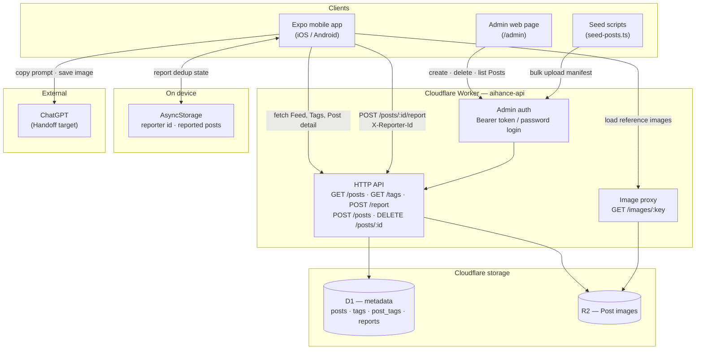

# AIhance

A community app for discovering AI image styles and applying them to your own photos. Browse a curated feed of Posts, copy a style or prompt, and Handoff to an external AI app (e.g. ChatGPT) to Restyle your image.

See [CONTEXT.md](./CONTEXT.md) for domain vocabulary and [docs/adr/](./docs/adr/) for architecture decisions.

## Architecture



### Request flow

1. **Feed browse** — The app calls `GET /tags` and `GET /posts` (optionally `?tag=slug`). The Worker reads metadata from D1 and returns image URLs that point back to `GET /images/:key`.
2. **Post detail** — `GET /posts/:id` returns the full image URL, optional prompt, tags, and created date.
3. **Handoff** — On the device: copy prompt to clipboard, save the reference image to the camera roll. No server round-trip.
4. **Report** — `POST /posts/:id/report` with a stable `X-Reporter-Id` (generated once and stored in AsyncStorage). D1 tracks one report per reporter per Post.
5. **Admin** — Password login at `/admin` returns a Bearer token. Admins create and delete Posts; images upload to R2 and metadata lands in D1. Seed scripts can bulk-load the launch dataset from `worker/seed/posts.json`.

### Components

| Layer | Tech | Role |
|-------|------|------|
| Mobile app | Expo 54, React Native, Expo Router | Consumer UI — feed grid, tag filter, post detail, Handoff, Report |
| Feed API | Cloudflare Worker (TypeScript) | Single HTTP surface for app, admin, and seed tooling |
| Metadata | Cloudflare D1 (SQLite) | Posts, tags, report counts, report dedup |
| Images | Cloudflare R2 | Post reference images served via Worker proxy |
| Admin | HTML page served by Worker | Password-protected moderation and Post management |

Auth for Consumers is deferred to v1+ ([ADR-0002](./docs/adr/0002-better-auth-social-login.md)). v1 is anonymous browse, Handoff, and Report.

## Project structure

```
aihance/
├── app/                  # Expo Router screens (Feed, Post detail)
├── components/           # UI components (feed grid, post actions, etc.)
├── lib/                  # API client, Handoff helpers, theme, reporting
├── worker/               # Cloudflare Worker Feed API
│   ├── src/              # API routes and admin page
│   ├── migrations/       # D1 schema
│   └── seed/             # Launch dataset manifest and scripts
├── docs/adr/             # Architecture decision records
└── CONTEXT.md            # Domain model and glossary
```

## Get started

### Prerequisites

- [Bun](https://bun.sh) (package manager for app and worker)
- [Expo CLI](https://docs.expo.dev/get-started/installation/) (via `bunx expo`)
- iOS Simulator or Android emulator (or a physical device with Expo Go / dev build)

### Install

```bash
bun install
cd worker && bun install && cd ..
```

### Run the API locally

```bash
bun run api:seed    # apply D1 migrations and seed curated tags
bun run api:dev     # start Worker at http://localhost:8787
```

See [worker/README.md](./worker/README.md) for endpoints, admin setup, and seeding the launch dataset.

### Run the mobile app

In a second terminal:

```bash
bun ios       # or: bun android
```

The app auto-detects the Worker URL in dev:

- Android emulator → `http://10.0.2.2:8787`
- iOS simulator / physical device → your Mac's LAN IP from Expo

Override with `EXPO_PUBLIC_FEED_API_URL` if needed.

## Scripts

| Command | Description |
|---------|-------------|
| `bun ios` / `bun android` | Start Expo dev server and open simulator |
| `bun run lint` | ESLint |
| `bun run typecheck` | TypeScript check (app) |
| `bun run api:dev` | Start Cloudflare Worker locally |
| `bun run api:test` | Worker API tests (Vitest) |
| `bun run api:seed` | Migrations + curated tag seed |
| `bun run api:seed:posts` | Bulk upload Posts from manifest |

## Further reading

- [Worker API & admin guide](./worker/README.md)
- [Domain model & glossary](./CONTEXT.md)
- [ADR-0001: R2 + D1 storage split](./docs/adr/0001-cloudflare-r2-d1.md)
- [ADR-0002: better-auth (v1+)](./docs/adr/0002-better-auth-social-login.md)
